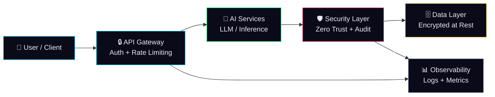

# SOVEREIGN AI INFRASTRUCTURE

> Building secure, zero-trust, and privacy-first AI architectures.

---

## Why Sponsor This Work

Independent research in sovereign AI infrastructure is expensive, time-consuming, and critical. This work exists outside the influence of Big Tech roadmaps and VC-driven priorities — and your sponsorship keeps it that way.

By sponsoring, you directly fund:

- **Sovereign AI Infrastructure** — development of deployment models that give organizations full ownership of their AI stack
- **Open Security Architectures** — publicly documented, auditable security frameworks for AI systems
- **Zero-Trust Deployment Models** — blueprints for AI pipelines with no implicit trust at any layer
- **Compliance-Ready Enterprise Blueprints** — production-grade templates mapped to SOC 2, ISO 27001, and GDPR requirements
- **Independent AI Security Research** — unbiased threat modeling and red-teaming documentation for LLM-integrated systems

This work does not answer to a product roadmap. It answers to the engineers and security architects who need it.

---

## Sponsor Benefits

Every sponsorship tier unlocks exclusive access to research outputs before they are made public:

- **Early access to architecture blueprints** — get production-ready designs weeks before public release
- **Private research notes** — raw thinking, threat models, and decision logs from active projects
- **Security frameworks** — reusable security posture templates for AI-integrated systems
- **Infrastructure templates** — IaC modules, deployment configs, and hardened baseline environments
- **Technical briefings** — concise writeups on emerging AI security threats and mitigation strategies

---

## Projects

### 🛡️ Sentinel Prime
AI security architecture and SecOps blueprint for resilient AI infrastructure. Covers threat modeling, incident response playbooks, and observability patterns for LLM-based systems deployed in enterprise environments.

`AI Security · SecOps · Threat Modeling`

---

### 🌐 LocalPulse
Sovereign AI infrastructure platform focused on privacy-first deployments. Enables organizations to run production-grade AI workloads entirely on-premises, with zero telemetry and full data residency control.

`Sovereign AI · Privacy-First · On-Premises`

---

### 📋 SecOps Blueprint
Enterprise compliance and AI security architecture framework. A structured collection of policies, controls, and implementation guides for organizations integrating AI into regulated environments.

`Compliance · ISO 27001 · SOC 2 · AI Governance`

---

## AI Infrastructure Architecture

Every component in the stack is designed for auditability, minimal blast radius, and zero implicit trust between services.

---

## Monthly Sponsorship Tiers

### ☕ $5 / month — Vanilla Supporter

Every contribution counts. You directly support the continuous development of bloat-free, open-source resources.

**Reward:**
- Sponsor badge on your GitHub profile

---

### 🚀 $25 / month — Clean Code Insider

Perfect for developers who want behind-the-scenes access to architecture as it evolves.

**Rewards:**
- Name or logo featured in project README
- Access to private sponsorware repositories

---

### 🏢 $100 / month — Startup Partner

Designed for startups integrating AI security architecture into their stack.

**Rewards:**
- Company logo on project website
- Priority bug reports and feature requests
- All previous rewards

---

### 👑 $500 / month — Enterprise Gold

For organizations that rely on this architecture and want to stay ahead.

**Rewards:**
- 1 hour consulting session per month
- All previous rewards

---

### 💎 $1,000 / month — VIP Corporate Support

Direct technical partnership for enterprise teams embedding sovereign AI.

**Rewards:**
- Direct technical partnership
- Access via Slack / Discord / Teams for ongoing architectural consulting
- All previous rewards

---

## One-Time Support & Consulting

| Amount | What You Get |
|--------|-------------|
| **$50** | Shoutout in release notes + access to sponsorware repositories |
| **$200** | 1-hour pair programming session — remote screen-sharing, debugging, or code review |
| **$350** | 1-hour architecture mentorship — deep consulting on system design and scalability |
| **$1,000** | Bug bounty / feature request — priority development of a specific fix or feature |
| **$2,000** | Tech talk / workshop — remote technical presentation or hands-on workshop |
| **$5,000** | Enterprise custom contract — large-scale architecture work and implementation support |

---

## Support Sovereign AI Infrastructure

> If this work is valuable to you or your organization, consider becoming a GitHub Sponsor and help accelerate the development of secure AI systems.

The infrastructure being built here — zero-trust AI pipelines, compliance-ready blueprints, sovereign deployment models — is the kind of foundational work that rarely gets funded by product companies because it doesn't ship a feature. It ships a foundation.

**Your sponsorship changes that.**

---

*Ciprian Stefan Plesca · IAȘI, Romania · [contact@localpulse.pro](mailto:contact@localpulse.pro)*
